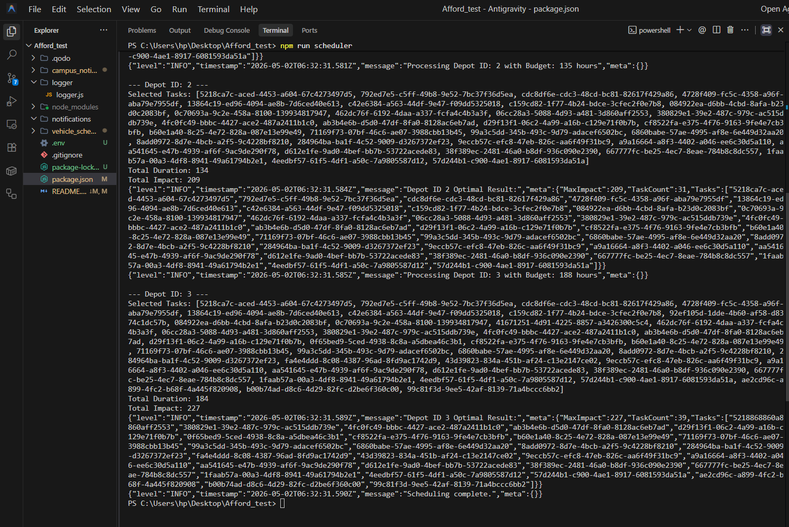
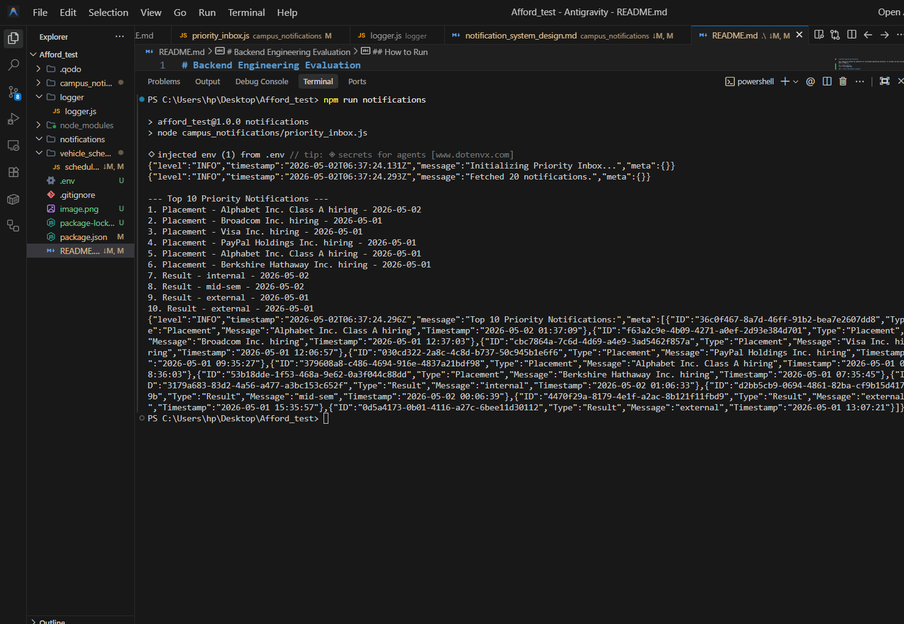

# Backend Engineering Evaluation


This repository contains my submission for the backend engineering evaluation. It includes two main microservices built in Node.js.

## 📸 Output Results

> [!NOTE]
> All output screenshots are saved directly within their respective module folders (`vehicle_scheduling` and `campus_notifications`).

### 1. Vehicle Maintenance Scheduler



### 2. Priority Notification Inbox



## Project Structure

- `vehicle_scheduling/` - A scheduler script (`scheduler.js`) that fetches depot and vehicle task data from the evaluation API. It uses a dynamic programming approach to find the optimal subset of maintenance tasks without exceeding the depot's mechanic hours.
- `campus_notifications/` - Contains the system design document (`notification_system_design.md`) answering the architectural questions, and a priority inbox script (`priority_inbox.js`) that fetches and sorts notifications by priority (Placement > Result > Event) and timestamp.
- `logger/` - A custom logging middleware implementation used across the scripts instead of the default console logger.

## How to Run

Ensure you have Node.js installed (v18+ recommended). You can test the scripts directly from the terminal:

```bash
# Run the vehicle scheduling algorithm
node vehicle_scheduling/scheduler.js

# Run the priority inbox algorithm
node campus_notifications/priority_inbox.js
```
